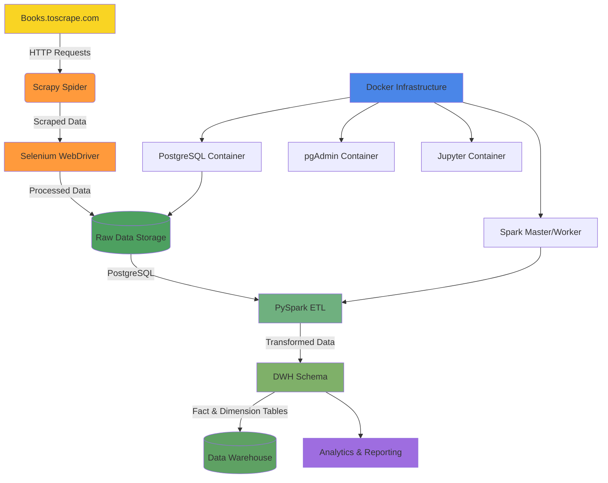

# Books Scraper & ETL Pipeline


## Описание проекта

Система для сбора, хранения и обработки данных о книгах с сайта [books.toscrape.com](http://books.toscrape.com). 


## Технологический стек

- **Python 3.12+**
- **Scrapy** - фреймворк для веб-скрапинга
- **Selenium** - автоматизация браузера для JavaScript-сайтов
- **PostgreSQL** - реляционная база данных
- **PySpark** - фреймворк для обработки больших данных
- **Docker** - контейнеризация инфраструктуры
- **SQLAlchemy** - ORM для работы с БД

## Структура проекта

```
DE_scrapy/
├── books_scraper/          # Scrapy-скрейпер книг
│   ├── spiders/           # Пауки для парсинга
│   ├── pipelines.py       # Пайплайны обработки данных
│   ├── middlewares.py     # Промежуточное ПО
│   └── settings.py        # Настройки скрейпера
├── database/              # Скрипты управления базой данных
│   └── schema_manager.py  # Управление схемой DWH
├── pyspark_etl.py         # Основной ETL-процесс
├── etl_logger.py          # Система логирования ETL
├── docker-compose.yml     # Инфраструктура контейнеров
├── requirements.txt       # Зависимости Python
├── .env.example          # Пример файла конфигурации
└── init.sql              # Инициализация БД
```

## Диаграмма архитектуры



## Компоненты системы

### 1. Скрапинг (Scrapy + Selenium)

- **Цель**: Сбор данных о книгах с сайта books.toscrape.com
- **Технологии**: Scrapy, Selenium WebDriver, Chrome Headless
- **Функции**:
  - Парсинг детальных страниц книг
  - Извлечение информации: название, цена, описание, рейтинг, категории
  - Обработка таблиц с техническими характеристиками
  - Определение наличия и количества товаров
  - Оценка качества собранных данных

### 2. Хранение данных (PostgreSQL)

- **Цель**: Хранение сырых и обработанных данных
- **Технологии**: PostgreSQL, SQLAlchemy ORM
- **Структура**:
  - `raw_books` - таблица для сырых данных
  - Схема `dwh` - для обработанных данных (факты и измерения)

### 3. ETL-процесс (PySpark)

- **Цель**: Трансформация и загрузка данных в DWH
- **Технологии**: Apache Spark, PySpark
- **Функции**:
  - Очистка и дедупликация данных
  - Создание справочников (категории, типы продуктов, рейтинги)
  - Формирование фактовой таблицы книг
  - Анализ качества данных
  - Загрузка в DWH-схему

### 4. Инфраструктура (Docker)

- **Компоненты**:
  - PostgreSQL: основная база данных
  - pgAdmin: веб-интерфейс для управления БД
  - Spark Master/Worker: кластер Spark для ETL
  - Jupyter: среда для анализа данных

## Установка и запуск

### 1. Клонирование репозитория

```bash
git clone <repository-url>
cd DE_scrapy
```

### 2. Установка зависимостей

```bash
pip install -r requirements.txt
```

### 3. Настройка конфигурации

Скопируйте пример файла конфигурации и настройте параметры:

```bash
cp .env.example .env
```

Отредактируйте `.env` файл, указав свои значения:

```bash
# PostgreSQL
POSTGRES_HOST=localhost
POSTGRES_PORT=5432
POSTGRES_DB=books_db
POSTGRES_USER=postgres
POSTGRES_PASSWORD=password

# pgAdmin
PGADMIN_EMAIL=admin@example.com
PGADMIN_PASSWORD=admin_password

# Selenium
SELENIUM_HEADLESS=true
```

### 4. Запуск инфраструктуры

```bash
docker-compose up -d
```

### 5. Запуск скрапинга

Перейдите в директорию скрейпера и запустите:

```bash
cd books_scraper
```

#### Запуск с ограничением количества записей (например, 5):

```bash
scrapy crawl books_toscrape -s CLOSESPIDER_ITEMCOUNT=5 -L INFO
```

#### Запуск без ограничений (все книги):

```bash
scrapy crawl books_toscrape
```

### 6. Запуск ETL-процесса

После завершения скрапинга запустите ETL-процесс:

```bash
python pyspark_etl.py
```

Для принудительного удаления существующих таблиц DWH перед запуском:

```bash
python pyspark_etl.py --drop
```

## Структура данных

### Сырые данные (raw_books)

| Поле | Тип | Описание |
|------|-----|----------|
| id | SERIAL | Уникальный идентификатор |
| url | VARCHAR(500) | URL книги |
| scraped_at | TIMESTAMP | Время сбора данных |
| title | VARCHAR(500) | Название книги |
| price | FLOAT | Цена |
| availability | VARCHAR(100) | Наличие |
| description | TEXT | Описание книги |
| upc | VARCHAR(50) | Универсальный код продукта |
| rating | INTEGER | Рейтинг (0-5) |
| category | VARCHAR(200) | Категория |

### DWH схема

#### Справочники:
- `dwh.dim_categories` - Категории книг
- `dwh.dim_product_types` - Типы продуктов
- `dwh.dim_ratings` - Рейтинги (0-5 звезд)

#### Фактовая таблица:
- `dwh.fact_books` - Основная таблица книг с внешними ключами

## Логирование

Проект включает продвинутую систему логирования:

- **Скрапинг**: Логирование процесса сбора данных
- **ETL**: Подробное логирование трансформаций и загрузки
- **Файлы логов**: Сохраняются в директории `logs/`

## Безопасность и надежность

- **Обход блокировок**: Использование случайных User-Agent и задержек
- **Повторные попытки**: Автоматические повторы при ошибках HTTP
- **Валидация данных**: Проверка и очистка полученных данных
- **Обработка ошибок**: Комплексная система обработки исключений

## Мониторинг и отладка

- **Статистика выполнения**: Подсчет обработанных, вставленных и обновленных записей
- **Качество данных**: Оценка полноты и корректности собранных данных
- **Прогресс-бары**: Отслеживание прогресса скрапинга и ETL


## Проект выполнили:
- Михалева Анна Геннадьевна
- Мухамеджанов Евгений Михайлович

